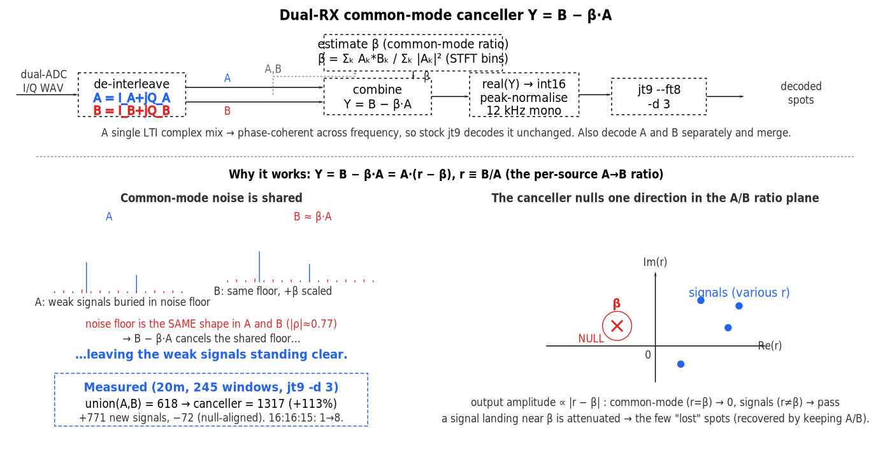

# Common-mode cancellation

The two ADCs of a TRX-duo dual-ADC (diversity) channel do **not** behave like
independent diversity branches: their noise is largely **common-mode** — the same thing
in both channels, up to a complex scale. That one fact changes how the two antennas
should be combined, and it is what the **`common-mode-cancelling`** decoder (a sibling of
[`wav-to-decoder`](../host_app/gofcfb/README.md)) exploits. This document explains the
method, why it works, the measured gain, and how to turn it on.

It operates on the complex-I/Q WAV `fcfbfarm` writes with `wav_format = iq`; see
[`iq-format.md`](iq-format.md) for that format.

## 1. The problem it solves

On an hour of real dual-ADC I/Q the two receive chains' broadband coherence is
0.75–0.93 and the in-band **noise correlation is |ρ| ≈ 0.77** — the noise (and any
broadband interference) is largely **common-mode**. The A and B power spectra have the
*same shape*; B is just the A spectrum scaled by a near-constant complex gain.

That overturns the textbook plan. Averaging-type diversity combiners — equal-gain
(co-phased sum) and SNR-weighted maximum-ratio combining (MRC) — assume **independent**
noise. Here they **lose**: co-phasing to add the signal coherently adds the common-mode
noise coherently too, so the output SNR does not improve and is usually *worse* than just
keeping the better antenna (EGC median −0.8 dB, MRC −0.5 dB vs the better single antenna).
So do **not** build an MRC combiner for this hardware, and do **not** weight by channel
power (one antenna can read hotter only because its front end has more gain *and* a higher
noise floor).

## 2. The approach

Cancel the common mode instead of averaging it. Form a single combined channel

```
                 Σ_k A_k* B_k
C = B − β·A,   β = ───────────
                   Σ_k |A_k|²
```

`β` is a **single complex scalar**: the least-squares A→B ratio. Because the noise fills
the whole band while the wanted signals are sparse and narrowband, `β` is dominated by the
noise and estimates the **common-mode ratio**. Subtracting `β·A` from `B` then nulls the
shared noise/interference across the whole band, and the weak signals buried under it stand
clear.



Key properties that make it practical:

- **It is a single LTI complex mix** (fixed gains `1` on B and `−β` on A). Unlike a
  per-frequency-bin beamformer it cannot scramble phase across frequency, so the combined
  stream stays phase-coherent and every coherent decoder — `jt9` (FT8/FT4/FST4W) and
  `wsprd` — decodes it unchanged. (A per-bin MVDR was tried and did *worse* than one
  antenna, from ISTFT/per-bin-phase artifacts; the clean LTI canceller is both simpler and
  far better.)
- **Same audio path as a plain per-antenna decode:** take `real(C)`, peak-normalise to
  int16 at 12 kHz, run the decoder. Only the stream differs, so the comparison is
  apples-to-apples. The result matches decoding `real(C)` in any other tool.
- **Decoder-agnostic and modulation-agnostic** — it just produces a cleaner audio stream.
- **No FFT needed.** The formula above is written over STFT bins, but a frequency-flat `β`
  is mathematically a time-domain complex dot product; the implementation sums
  `Σ A*·B` and `Σ|A|²` directly over the window's samples (verified equivalent to the STFT
  estimate to ~1e-6).

## 3. Why it works — the A/B ratio plane

Write each source's channel as its complex **A→B ratio** `r ≡ B/A`. Then

```
C = B − β·A = A·(r − β)
```

so the canceller's output amplitude for any source is **∝ |r − β|**. It places a single
**null at `r = β`** in the ratio plane:

- The **common-mode noise/interference** sits at `r = β` by construction → **nulled**.
- A **wanted signal** arrives with its own spatial ratio `r ≠ β` (a different antenna
  phase/gain, because it comes from a different direction) → it **passes**, even when it
  was weaker than the noise that was removed.

This is spatial nulling in its simplest form: one global, frequency-flat null steered
automatically at whatever dominates the band. It is the rank-1, frequency-flat special case
of an MVDR combiner; referencing a per-signal MVDR to one antenna is the adaptive
generalisation.

## 4. Evidence

Two measurements on ~1 h of real dual-ADC captures (9 bands, 245 windows/band), each
decoding A, B and the canceller identically through the same `jt9` path.

**Initial exploration — 13.5 s windows, `jt9 --ft8 -d 3`.** On 20 m:

| channel | unique decodes |
|---|---:|
| union(A, B) | 618 |
| canceller `B − βA` | **1317  (+113 %)** |

That is **+771 real signals** neither antenna decoded (CRC-14 valid; most recur elsewhere
in the hour), at the cost of **72** spots whose ratio happened to match `β` and so fell in
the null. One illustrative window (16:16:15 UTC): A alone 1 decode, B alone 2, canceller
**8**. Across all 9 bands the canceller alone totalled **3814 vs 2011** for A∪B (+90 %),
and the production pipeline — decode A, B *and* `B − βA`, then merge — gave
**union(A, B, C) = 4179, +108 % over A∪B and strictly additive on every band**.

**Re-verification — full 15 s windows, `jt9 --ft8` at the farm's default depth** (the depth
the shipped decoder runs at). Totals: A = 2783, B = 2097, A∪B = 3328, canceller = 3582,
**pipeline union(A, B, CMC) = 4879 — +1551 (+47 %) over A∪B, positive on every band.** The
`common-mode-cancelling` tool's decodes match this reference byte-for-byte; a deeper search
(`-d 3`) widens the margin further, as the 13.5 s figures show.

Per band the canceller **alone** is strongly band-dependent: large where a hot/noisy channel
dominates (30 m +299 %, 17 m +221 %, 20 m +80 %, 15 m +75 %, 10 m +40 %, 80 m +13 %), but
**net-negative where one antenna carries the strong signals** (40 m −47 %, 12 m −15 %) —
there `β` is set by the *wanted* signal and the null removes it. Keeping A and B turns that
into pure upside, which is why the tool always decodes and merges all three.

## 5. Using it — the `common-mode-cancelling` decoder

Point an `fcfbfarm` `[decoder]` at `common-mode-cancelling` and set `wav_format = iq`:

```ini
[fcfbfarm]
wav_format = iq          ; 4-ch float I/Q (the canceller needs both antennas' baseband)

[decoder]
name   = ft8
cmd    = common-mode-cancelling jt9 --ft8 {wav}
parser = jt9
period = 15
capture = 13.5
```

For each dual-ADC I/Q window it decodes **three** channels — antenna A, antenna B, and
`C = B − βA` — tagging each with `#ANT A` / `#ANT B` / `#ANT CMC`, which `fcfbfarm` merges
(dedup by message + frequency). A ready configuration for all bands and modes is
[`examples/allbands-dual-cmc.ini`](../host_app/gofcfb/examples/allbands-dual-cmc.ini).

- **Always keep A and B.** The canceller alone is band-dependent (above); the ~10–15 % of
  spots that fall in the null are recovered by the plain A/B decodes, so the merged union is
  ≥ any one channel. The cost is two extra decoder runs per window.
- **`--ref`** selects the reference antenna: the default `--ref A` gives `C = B − βA`;
  `--ref B` gives `C = A − βB` (β referenced to B).
- **It requires the I/Q WAV.** `common-mode-cancelling` hard-fails on a non-dual-I/Q WAV,
  and `fcfbfarm` **fails fast at startup** if a `common-mode-cancelling` decoder is
  configured without `wav_format = iq`.
- **It is decoder-agnostic:** the same wrapper works with `jt9 --ft4`, `jt9 --fst4w …` and
  `wsprd -f {fmhz}`. The canceller knows nothing about the modulation, so the gain is
  expected on any mode whose common-mode noise dominates `β` (weak, sparse modes like WSPR
  are the most favourable).
- **Upgrade path = more nulls.** A single global `β` nulls one direction. If `ρ` turns out
  to be dominated by a few strong broadband interferers, a small set of nulls (or a
  per-signal MVDR referenced to one antenna to preserve phase) recovers signals that a
  single null attenuates.

## 6. Caveats

- Gain is **band-dependent**, and the canceller *alone* is **net-negative** on the bands
  where one antenna carries the strong signals (so `β` nulls them). This is exactly why A,
  B *and* `B − βA` are always decoded and merged — the union is then positive on every band.
- A strong *wanted* signal that happens to share the common-mode ratio is attenuated — but
  that signal is normally also the easiest for the plain A/B decode to catch, so the merge
  recovers it.
- `β` is estimated per window (two sums over the samples). It can instead be treated as a
  fixed calibration if it proves stable across time.

---

*Reference implementation: `host_app/gofcfb/cmc.go` (package `fcfb`,
`common-mode-cancelling` command). Figure source: `docs/img/common-mode-canceller.svg`.
WAV format: [`iq-format.md`](iq-format.md). Host apps: the
[gofcfb README](../host_app/gofcfb/README.md).*
